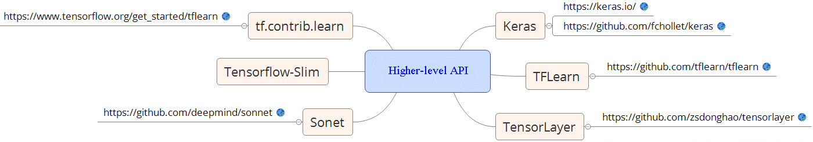
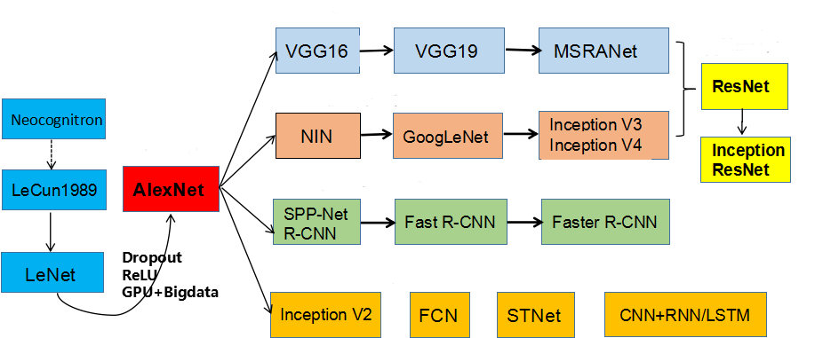

# TensorflowAnecdote
A tutorial of Google's tensorflow to step into Artificial Intelligence for beginners. (Tensorflow version: 1.3 & 1.4) 
[Deep learning libraries featuring a higher-level API for TensorFlow](https://blog.csdn.net/chenhaifeng2016/article/details/73935156):  

The development history of CNN (Convolutional Neural Network):

## What is Tensorflow?
* [General](https://www.tensorflow.org/): TensorFlow is an Open Source Software Library for Machine Intelligence
* [Specific](https://www.tensorflow.org/): TensorFlow is an open source software library for numerical computation using data flow graphs.

## File Description
* 02-train_predict: China railway passenger volume forecast
* 04-voice_gender: judging sex by features of voice
* 05-name_gender: judging sex by Chinese name
* 06-TFLearn_CNN: using TFLearn to rewrite convolution neural network written by Tensorflow
* 07-WiFi_locate_autoencoder: indoor location by WiFi fingerprint and deep autoencoder. Click [here](https://archive.ics.uci.edu/ml/machine-learning-databases/00310/UJIndoorLoc.zip) to download the WiFi data - "UJIndoorLoc.zip" and unzip it to current folder.
* 08-MNIST: deep learing using the [MNIST](http://yann.lecun.com/exdb/mnist/) dataset.

## References & Code Source
* https://www.zybuluo.com/hanbingtao/note/433855
* http://blog.csdn.net/zouxy09/article/details/14222605
* [Spoken_Number_Recognition](https://github.com/RichardLiuLiu/Spoken_Number_Recognition)
* @斗大的熊猫: http://blog.topspeedsnail.com.
* [cifar-10-cnn](https://github.com/BIGBALLON/cifar-10-cnn)
* [stanford_cars](https://github.com/DanilGizdatullin/stanford_cars)
* [cnn_history](https://blog.csdn.net/cyh_24/article/details/51440344)

_More code will be uploaded soon!_
